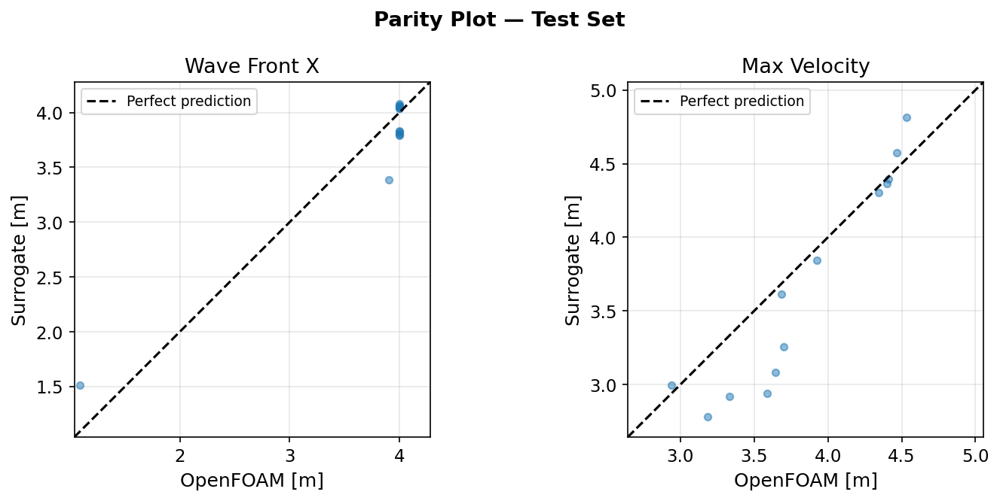
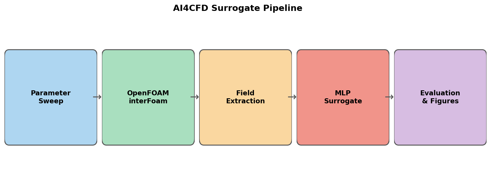

# ai4cfd-openfoam-surrogate


A small PyTorch surrogate model for OpenFOAM dam-break outputs from water height, water width, and time.

## Background

I worked on ANSYS Fluent simulations of a limestone contactor for desalinated water post-treatment (JESA/OCP, Morocco). This project explores whether a small neural network can approximate OpenFOAM dam-break simulation outputs from just three parameters.

The model predicts two scalar quantities from an `interFoam` case:

| Input | Outputs |
|---|---|
| `water_height`, `water_width`, `time` | `wave_front_x`, `max_velocity` |

## Why This Exists

Surrogate modelling is often presented with large datasets and expensive architectures. I wanted a smaller experiment that still has the full engineering loop: CFD case setup, field extraction, dataset building, model training, metric reporting, and figures that expose where the approximation works and where it does not.

## Pipeline

```text
+-------------------------------------------------------------------+
|                  AI4CFD Surrogate Pipeline                        |
+-------------------------------------------------------------------+

   Parameter space              OpenFOAM case generation
  +---------------+             +----------------------+
  | water_height  |             | blockMesh            |
  | water_width   | --cases-->  | setFields            | --run-->
  | case config   |             | interFoam            |
  +---------------+             +----------------------+
          |                                |
          |                                v
          |                     extracted_fields.csv
          |                                |
          +----------------------+---------+
                                 v
                         build_dataset.py
                                 |
                                 v
                  dataset.pt: [height, width, time]
                         -> [x_front, max_velocity]
                                 |
                                 v
                  MLP surrogate: 3 -> 64 -> 128 -> 64 -> 2
                                 |
                                 v
                    metrics.csv and evaluation figures
```

## Results

The numbers below come from `results/metrics.csv` after training on the included `sample_data/` cases.

| Output | MAE | RMSE | R2 | MaxAE | RelErr |
|---|---:|---:|---:|---:|---:|
| `wave_front_x` | 0.1688 | 0.2216 | 0.9179 | 0.5168 | 0.0641 |
| `max_velocity` | 0.2436 | 0.3258 | 0.5952 | 0.6509 | 0.0672 |

The wave-front position is the better-behaved target in this small dataset. The velocity target is noisier and less well fitted, which is expected because maximum velocity is more sensitive to local interface motion and mesh/time-step effects than the front location. I keep both outputs in the project because that contrast is useful: it shows where a small tabular surrogate starts to break down.

## Figures



Parity plot for the held-out sample rows. The front-position predictions stay close to the diagonal; the velocity predictions show larger scatter.



Pipeline overview generated by `scripts/visualize_results.py`.

Additional generated figures are available in `assets/error_distribution.png` and `assets/timeseries_h0p50_w0p40.png`.

## Installation

```bash
git clone https://github.com/abdou-elaoudi/ai4cfd-openfoam-surrogate.git
cd ai4cfd-openfoam-surrogate

python -m venv .venv
source .venv/bin/activate
pip install -r requirements.txt
```

On Windows PowerShell:

```powershell
python -m venv .venv
.\.venv\Scripts\Activate.ps1
pip install -r requirements.txt
```

OpenFOAM is only needed for generating new CFD cases. The included `sample_data/` path runs with Python alone.

## Usage

### Option A: full pipeline with OpenFOAM output

Use this path after generating or collecting OpenFOAM case outputs.

```bash
python scripts/generate_cases.py \
    --n-cases 20 \
    --height-range 0.4 0.8 \
    --width-range 0.3 0.6 \
    --output-dir simulations/

python scripts/run_simulations.py \
    --cases-dir simulations/ \
    --np 4

python scripts/extract_fields.py \
    --cases-dir simulations/ \
    --output-dir data/extracted/

python scripts/build_dataset.py \
    --extracted-dir data/extracted/ \
    --config simulations/cases_config.json \
    --output data/dataset.pt

python models/train.py \
    --dataset data/dataset.pt \
    --epochs 200 \
    --output checkpoints/

python models/evaluate.py \
    --dataset data/dataset.pt \
    --checkpoint checkpoints/best_model.pt \
    --figures-dir results/figures/
```

### Option B: included sample data

```bash
python scripts/build_dataset.py \
    --extracted-dir sample_data/ \
    --config sample_data/cases_config.json \
    --output data/dataset.pt

python models/train.py \
    --dataset data/dataset.pt \
    --epochs 200 \
    --output checkpoints/

python models/evaluate.py \
    --dataset data/dataset.pt \
    --checkpoint checkpoints/best_model.pt \
    --figures-dir results/figures/

python scripts/visualize_results.py \
    --dataset data/dataset.pt \
    --checkpoint checkpoints/best_model.pt \
    --figures-dir results/figures/
```

## Limitations

This is not a replacement for CFD simulation.

| Limitation | Consequence |
|---|---|
| The included dataset has 3 cases and 78 total rows. | Generalisation outside the sampled range is weak. |
| The model predicts only two scalar outputs. | It does not reconstruct full pressure, velocity, or volume-fraction fields. |
| The dam-break setup is simplified. | Three-dimensional effects, obstacles, bathymetry, and turbulence are outside scope. |
| Time is treated as an input feature. | The network is not a time integrator and can miss temporal consistency. |
| There is no uncertainty estimate. | Predictions should be checked against CFD data before engineering use. |

The current results are enough to test the workflow: case data to tensor dataset, training, checkpointing, metrics, and plots. They are not enough to claim general surrogate accuracy for dam-break CFD.

## Tech Stack

| Layer | Tools |
|---|---|
| CFD setup | OpenFOAM `interFoam`, `blockMesh`, `setFields` |
| Data preparation | Python, NumPy, Pandas |
| Model training | PyTorch |
| Metrics | scikit-learn, custom metric helpers |
| Figures | Matplotlib, Seaborn |

## License

MIT. See [LICENSE](LICENSE).
